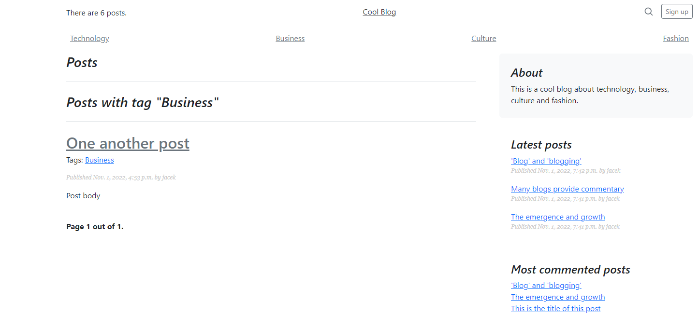

# Blog site using Django framework

## Screenshots

| Main page | Business tag | Post detail |
| -------|--------------|-----------------|
|  |  |  |

## Functionality

- custom manager
- tags(django-taggit) - filtering, recommendations
- email posts recommendations

## Installing

### Clone the project

```
git clone https://github.com/JacekKowal/Blog.git
```

### Install dependencies & activate virtualenv

```
pip install pipenv

pipenv install
pipenv shell
```

### Configure the settings (connection to the databasee)

1. Edit `Blog/settings.py` for database settings.

### Apply migrations

```
python Blog/manage.py migrate
```

### Running a development server

```
python Blog/manage.py runserver
```
